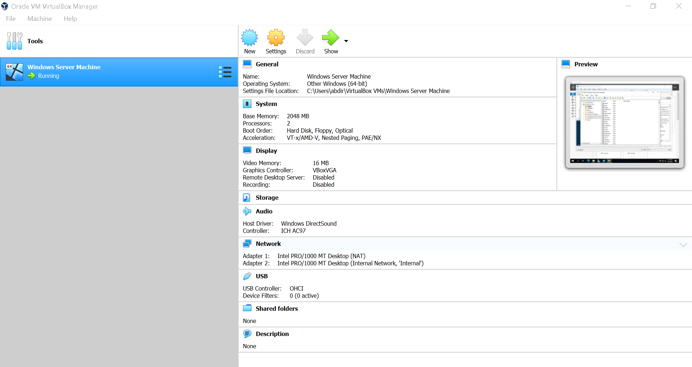
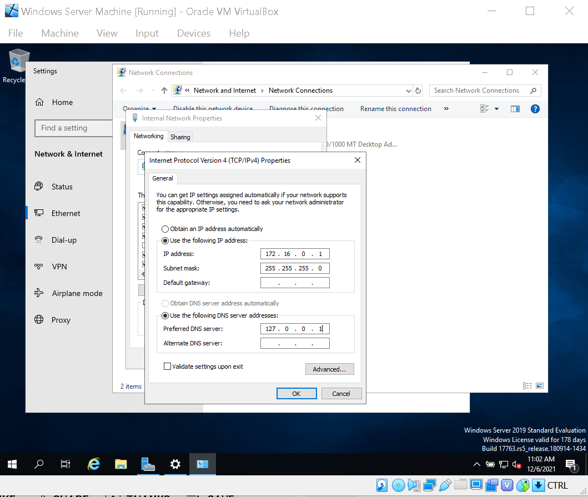
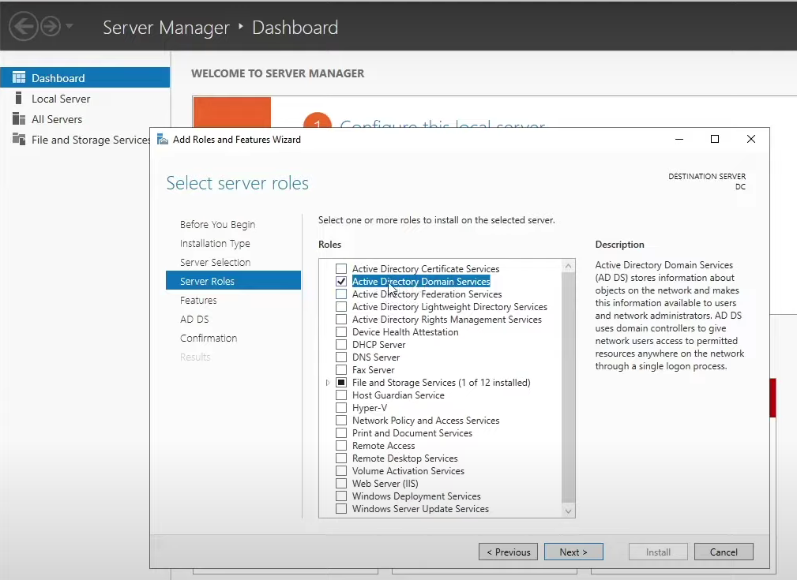
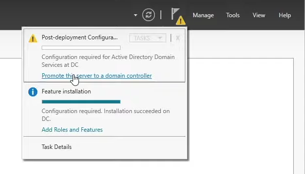
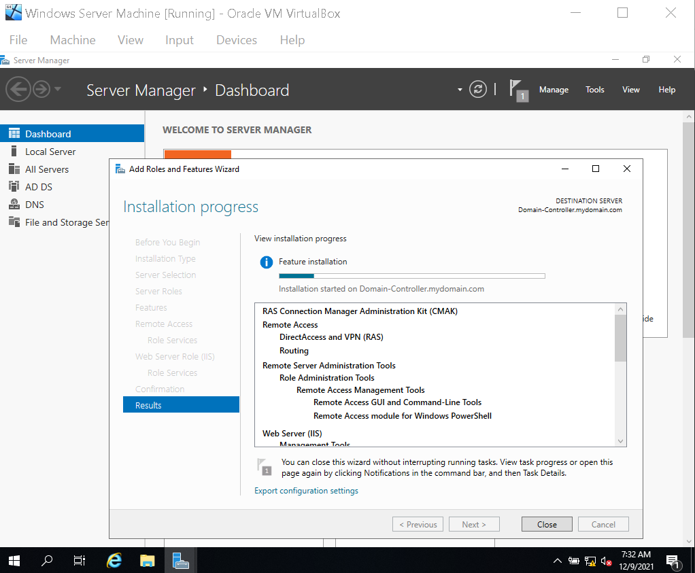
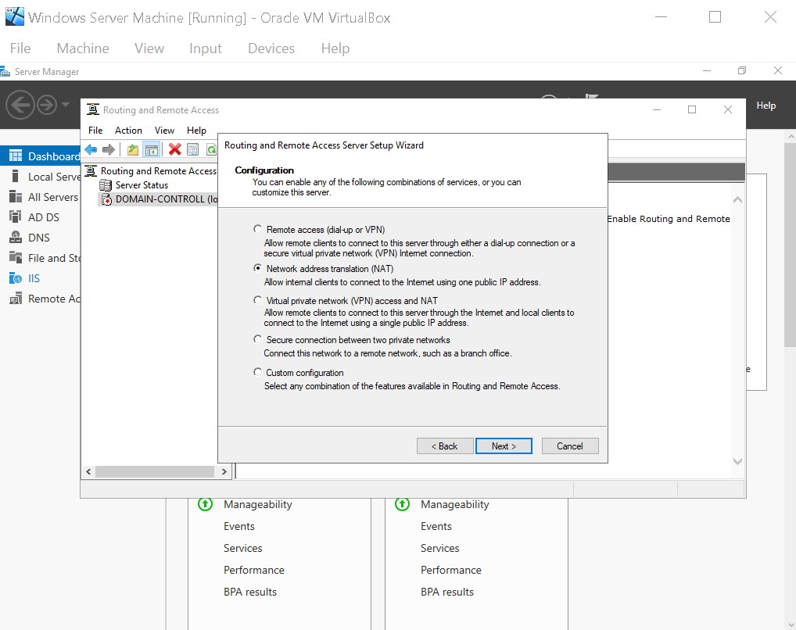

# Virtual-Homelab
This project incorporates the use of Oracle VM VirtualBox to create an Active Directory environment. The project consists of the creation of a Windows Server 2019 machine which is turned into an Active Directory Domain Controller. Next, the network was configured and a Windows 10 client machine was connected to the domain. A PowerShell script was also used to generate 100 user accounts. 

**Stage 1:** The first steps involved downloading Oracle VM VirtualBox which will create the Virtual environment to create the Windows Server and Windows 10 machines. After this, I created the Windows Server machine and set up the network adapters. 1 adapter will be used to connect the Windows Server machine to the internet, whilst a 2nd one will be dedicated for the internal network.

**Stage 2:** Next, we renamed the domain controller and began to configure the internal network IP settings. I set the desired IP address and the subnet mask. No default gateway was added as the domain controller itself would be acting as the default gateway/router for the rest of the internal network. Once that was completed I installed Active Directory Domain Services to the Server machine using the Server Manager. Then I promoted the Server machine to a domain controller.

**Stage 3:** After the Domain Controller was created, I set up a domain admin account and moved on to configuring the networking for the domain. Two things needed to be configured for this stage: RAS (Removte Access Server) and NAT (Network Address Translation). This would allow the joined Windows 10 machines to be part of the private virtual network as well as access the internet throught the domain controller; the domain controller acting as a router for the client machines. I began by installing a Remote Access Server thorugh the Server Manager. RAS is what allows the connected client machines to connect to the private virtual network remotely. Next, I installed NAT, which made it possible for all of the machines in the network to connect to the internet through a single IP address. 

