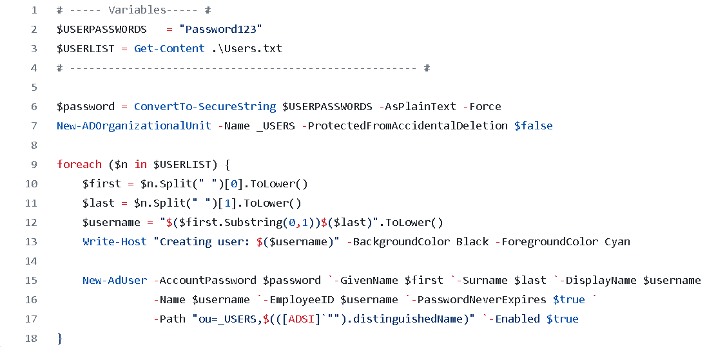

# Virtual-Homelab
This project incorporates the use of Oracle VM VirtualBox to create an Active Directory environment. The project consists of the creation of a Windows Server 2019 machine which is turned into an Active Directory Domain Controller. Next, the network was configured and a Windows 10 client machine was connected to the domain. A PowerShell script was also used to generate 100 user accounts. 

**Stage 1:** The first steps involved downloading Oracle VM VirtualBox which will create the Virtual environment to create the Windows Server and Windows 10 machines. After this, I created the Windows Server machine and set up the network adapters. 1 adapter will be used to connect the Windows Server machine to the internet, whilst a 2nd one will be dedicated for the internal network.

**Stage 2:** Next, we renamed the domain controller and began to configure the internal network IP settings. I set the desired IP address and the subnet mask. No default gateway was added as the domain controller itself would be acting as the default gateway/router for the rest of the internal network. Once that was completed I installed Active Directory Domain Services to the Server machine using the Server Manager. Then I promoted the Server machine to a domain controller.

**Stage 3:** After the Domain Controller was created, I set up a domain admin account and moved on to configuring the networking for the domain. Two things needed to be configured for this stage: RAS (Removte Access Server) and NAT (Network Address Translation). This would allow the joined Windows 10 machines to be part of the private virtual network as well as access the internet throught the domain controller; the domain controller acting as a router for the client machines. I began by installing a Remote Access Server thorugh the Server Manager. RAS is what allows the connected client machines to connect to the private virtual network remotely. Next, I installed NAT, which made it possible for all of the machines in the network to connect to the internet through a single IP address. 

**Stage 4:** After RAS and NAT were configured, it was time to move on to setting up DHCP. DHCP is a network  protocol that is used to automatically assign IP addresses to any of the client machines that are connected to the network. To set up DHCP in Active Directory, I went to the roles and features tab and added a DHCP server. Next I set the IP address range to be from 172.16.0.100 to 172.16.0.200. The default gateway was set to the IP address of the domain controller as that is what the client machines would use to connect to the internet. The Domain Controller has two network adapters. One to connect to the internal network which the client machines will also connect to and another one to access the internet. The Domain Controllers job is to forward any traffic from the client machines to the internet.  

**Stage 5:** The next stage involved the PowerShell script. This script was extremely helpful as it automatically generated 100 user accounts which would have taken a long time to do manually. The first part of the script sets important variables such as the passwords that each user would be granted by default. Another variable was used to extract the names of each user from a TXT file. The second part involved converting the default user password to a SecureString. The next line was to create the new organizational unit which would be called users. After this, a for loop was used to loop over each user stored in the $USERLIST object. The split method was used with the correct indexes to extract the first and last names for each user. Then these were used to create a username for each user, as well as al the other fields that needed to be filled in for each user. Once the script waas finished, I used Windows PowerShell ISE to run the powershell script script and this successfully created all of the users. 

**Stage 5:** Once the domain controller was fully set up and the PowerShell script was run, the next step was to connect a Windows 10 client to the domain. First I created a Windows 10 machines with an ISO. After this I connected it to the domain. After restarting the machine, I tested the connection by pinging the domain, which was successful. Then I checked the internet connection by pinging google.com, and that test was also successful. 

